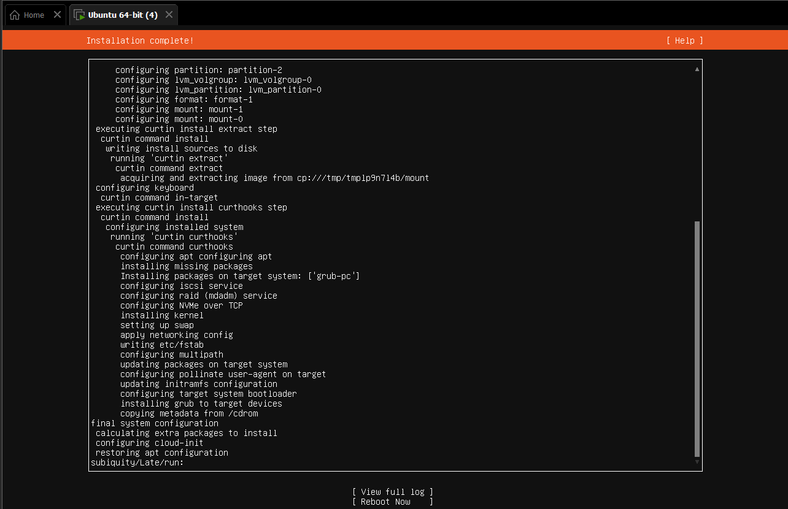

# Lab 1 – Installation of Ubuntu Server on VMware Workstation Pro

**Name:** Lujain Zia  
**Roll No:** 2023-BSE-034  
**Date:** September 26, 2025  

---

## Steps

### 1. Install Required Software
- Download and install **Ubuntu Server ISO**.
- Install **VMware Workstation Pro** on your system.

### 2. Create a Virtual Machine
- Open VMware Workstation Pro.
- Create a **new virtual machine**.
- Configure VM settings (memory, disk size, CPU, etc.).

### 3. Install Ubuntu Server
- Mount the **Ubuntu Server ISO** in VMware.
- Boot the VM and begin the installation process.
- Follow on-screen prompts to complete installation.

### 4. Establish Connection
- After installation, set up the **network connection** for the VM.
- Verify connectivity (e.g., using `ping` or checking updates).

---

## Notes
- Ensure your system meets the minimum requirements for VMware and Ubuntu.
- Allocate sufficient resources to the VM for smooth operation.
- Keep the ISO and VMware tools updated.

## Screenshots

